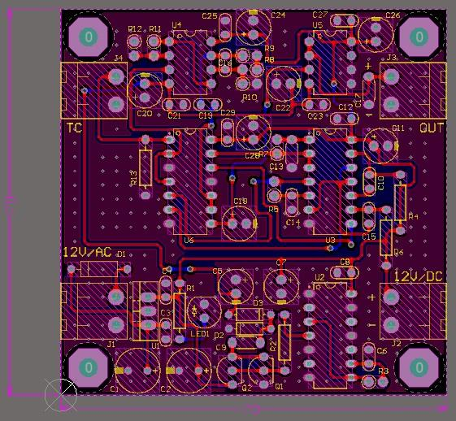

## Thermocouple Amplifier with Auto-Zero Offset Cancellation

### Pictures
PCB, 2D  

PCB, 3D  

### Features
- Auto-Zero offset cancellation
- 2-Layer PCB design

### Project Details
- Client from [Dirgodaz Amol Industries Inc., Iran](https://dirgodazamol.com/en/)
- Work type was remote
- Date in March 2024

### My Tasks
- Hardware design (50%)
- PCB design (100%)

