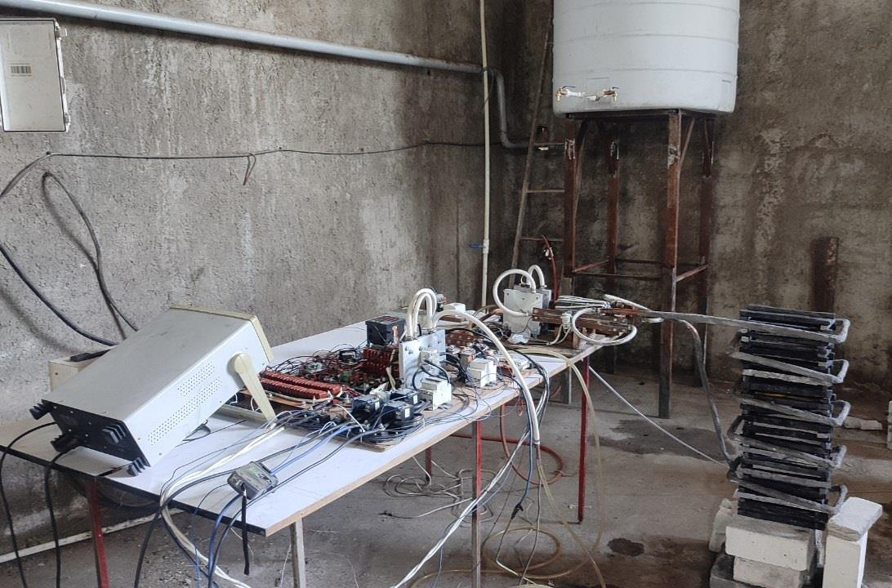
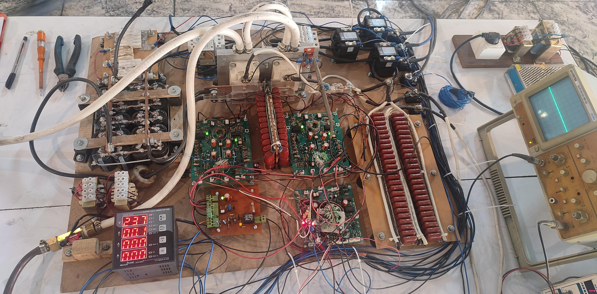
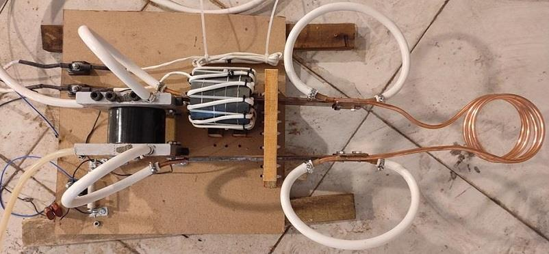
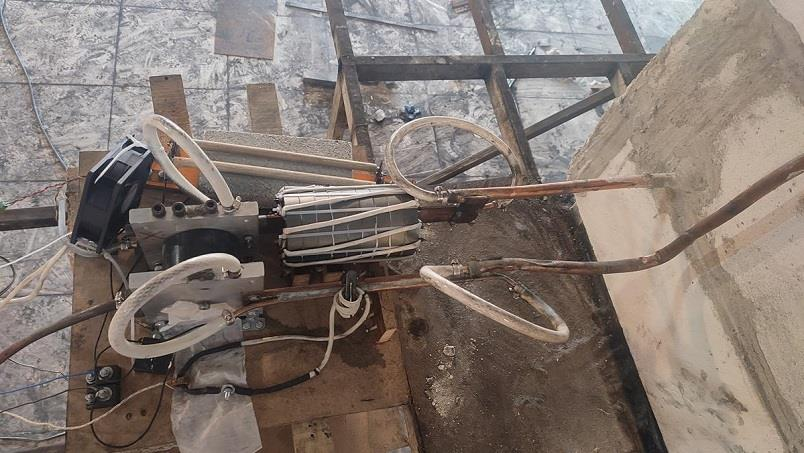
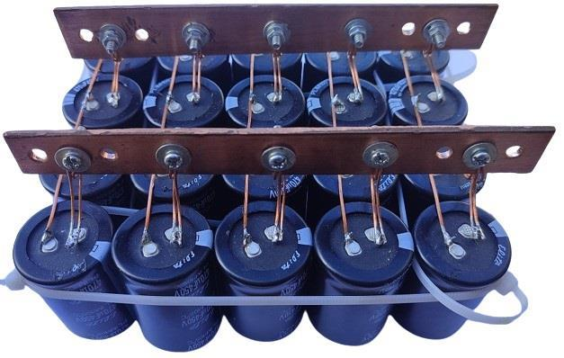
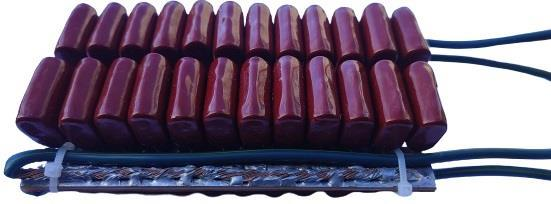
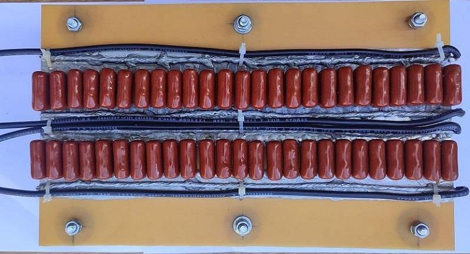
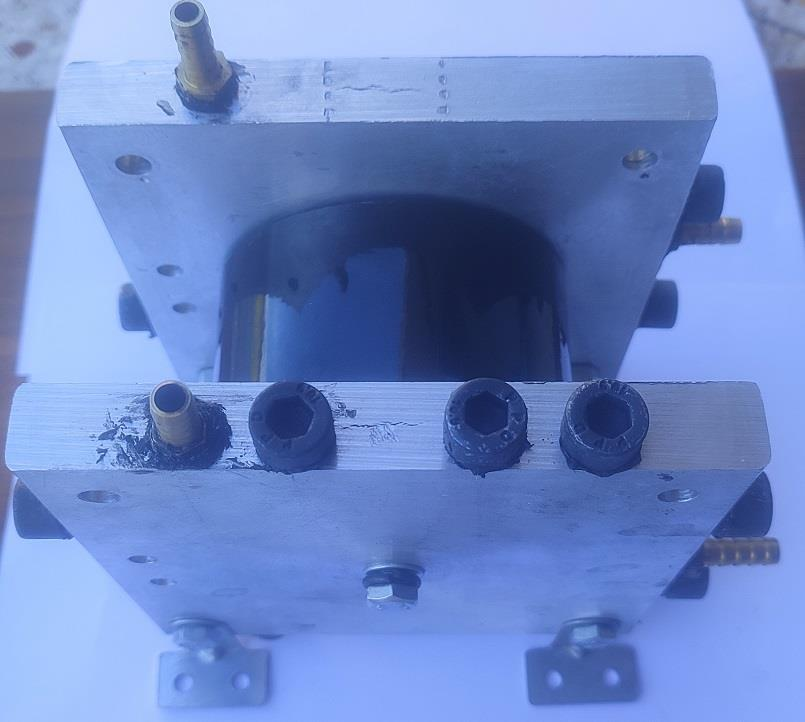

## Induction Heating, Controlled with PDM, 30KW

### Photo
Full View: v1.0  

### Features
- 3-Phase AC
- Full-bridge with IGBT
- Power controller with PDM

### Project Details
- Client from Alborz Amol Refractory Materials Industries, Iran.
- Work type was on-site
- Date in Oct 2023 - Dec 2023
 
### My Tasks
- PCB Assembly
  - Pulse Generator Board
  - IGBT Driver Boards
  - Capacitor Packages
- Heat sink & cooling design
- Panel integration
- Electrical wiring
- System testing
- Commissioning support
- Operated the system

Note: The project design was by my colleague. 

### More Photos
Inverter Panel: v1.0  

Transformer Panel: v1.0, with Test Coil  

Transformer Panel: v2.0  

Capacitor Package, DC BUS: v1.0  

Capacitor Package, DC Link: v1.0  

Capacitor Package, DC Blocking: v1.0  

Capacitor Colling: v1.0  

