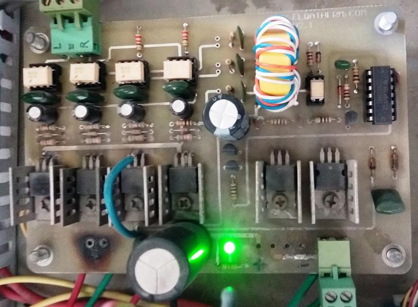
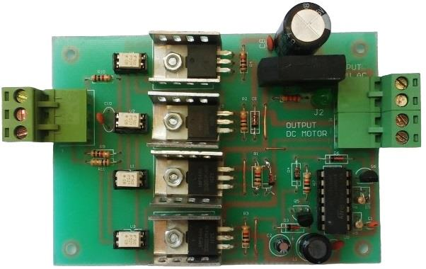
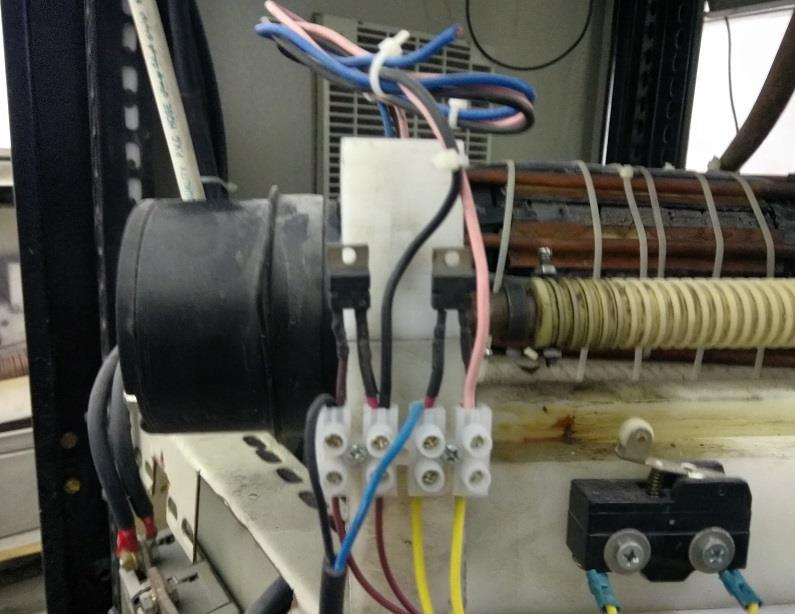

## 12V/5A Full-Bridge DC Motor Driver, Based on MOSFETs with Isolated Input

### Photos
v2.1  

v1.0  

### Features
- Full-Bridge Based on MOSFETs
- Isolated input using HCPL-3120
- 3 isolated power supplies using flyback converter

### Project Details
- Client from [Dirgodaz Amol Industries Inc., Iran](https://dirgodazamol.com/en/)
- Work type was on-site

### My Tasks
- Hardware Design (50%)
- PCB Design (100%)
- PCB Assembly (100%)

### More Photos

