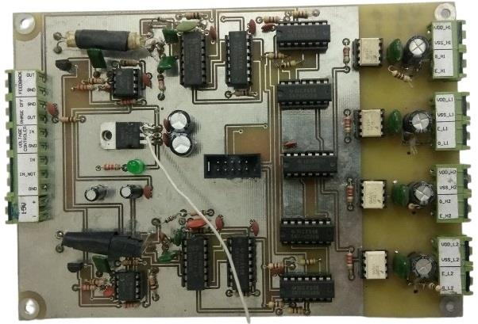

## Full Bridge IGBT Driver for Induction Heating, Model 1

### Photo
v1.0  

### Features
- Included PDM Generator
- IGBT Gate Drive Based on HCPL-3120
- 2-Layer PCB

### Project Details
- Client from [Dirgodaz Amol Industries Inc., Iran](https://dirgodazamol.com/en/)
- Work type was on-site

### My Tasks
- Hardware Design (25%)
- PCB Design (100%)
- PCB Assembly (100%)