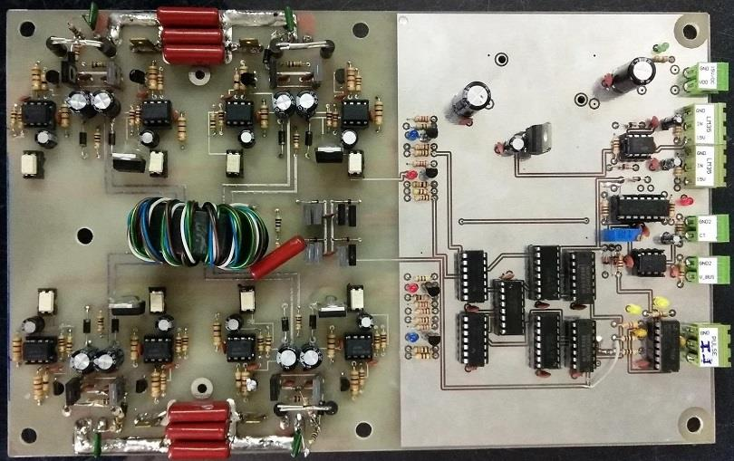
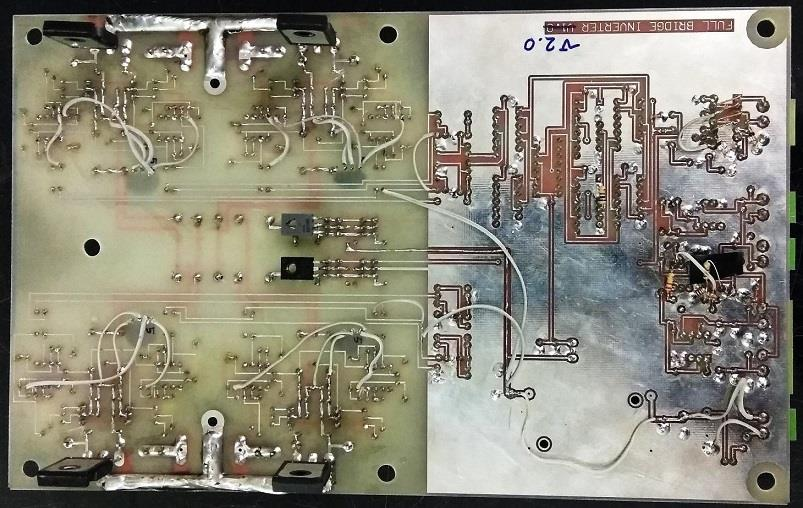

## Full Bridge IGBT Driver for Induction Heating, Model 2

### Photos
v2.0  

v2.0, Bottom  

### Features
- Included PDM Generator
- Included IGBTs
- 2-Layer PCB

### Project Details
- Client from [Dirgodaz Amol Industries Inc., Iran](https://dirgodazamol.com/en/)
- Work type was on-site

### My Tasks
- Hardware Design (25%)
- PCB Design (100%)
- PCB Assembly (100%)