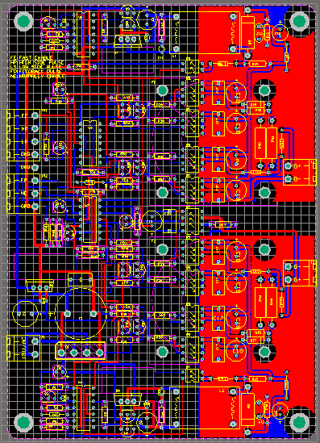
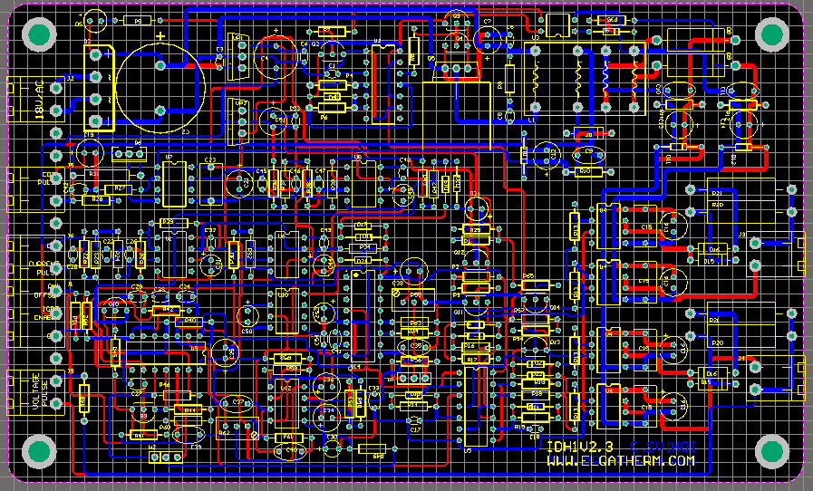
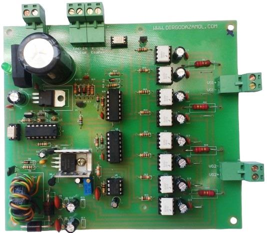

## Half Bridge IGBT Driver for Induction Heating

### Photo
v3.0  

v2.3  

v1.1  

### Features
- IGBT Gate Drive Based on HCPL-3120

### Project Details
- Client from [Dirgodaz Amol Industries Inc., Iran](https://dirgodazamol.com/en/)
- Work type was on-site

### My Tasks
- Hardware Design (25%)
- PCB Design (100%)
- PCB Assembly (100%)

