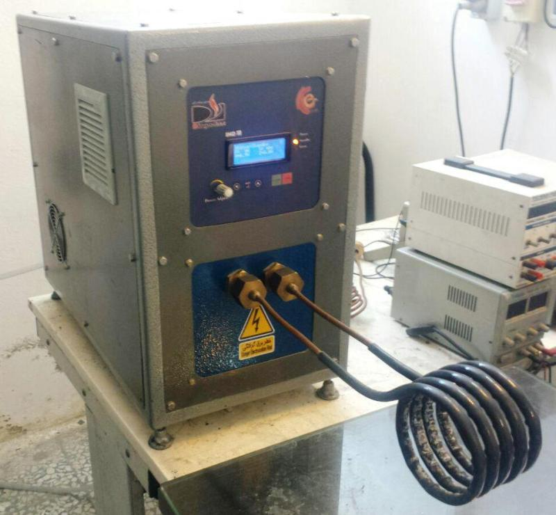

## Induction Heating, 10KW
Note: It was a prototype.

### Photo
Full View: v1.0  
 

### Features
- 1-Phase
- Half-Bridge with IGBT

### Project Details
- Client from [Dirgodaz Amol Industries Inc., Iran](https://dirgodazamol.com/en/)
- Work type was on-site
- Date in Jan 2017 - Jul 2017

### My Tasks
- Hardware Design, PCB Design, and PCB assembly of these boards:
  - [Half Bridge IGBT Driver For Induction Heating, Based On SKYPER32R Module](https://github.com/AliRezaJoodi/AliRezaJoodi.github.io/blob/main/ProjectNotes/DirgodazAmol_IgbtDriver_HalfBridge_BasedOnSKYPER32R.md)
  - [Single-Phase Dimmer, Based on Analog](https://github.com/AliRezaJoodi/AliRezaJoodi.github.io/blob/main/ProjectNotes/DirgodazAmol_PhaseDimmer_1Phase_BasedOnAnalog.md)
  - [Single-Phase Dimmer, Based on AVR MCU](https://github.com/AliRezaJoodi/AliRezaJoodi.github.io/blob/main/ProjectNotes/DirgodazAmol_PhaseDimmer_1Phase_BasedOnAVR.md)
  - [12V/5A Full-Bridge DC Motor Driver, Based on MOSFETs with Isolated Input](https://github.com/AliRezaJoodi/AliRezaJoodi.github.io/blob/main/ProjectNotes/DirgodazAmol_DcMotorDriver_FullBridge_Isolated_12V5A.md)
  - [Controller Board for Induction Heating Base on AVR MCU](https://github.com/AliRezaJoodi/AliRezaJoodi.github.io/blob/main/ProjectNotes/DirgodazAmol_ControllerBoardForInductionHeating.md)
  - Display Panel using 20×4 Character LCD
  - Capacitor packages
- Panel integration
- Electrical wiring
- System testing
- Commissioning support 

### Video
v1.0  
[A link on Youtube.com](https://www.youtube.com/watch?v=5HvjpDaDPMQ) 

 