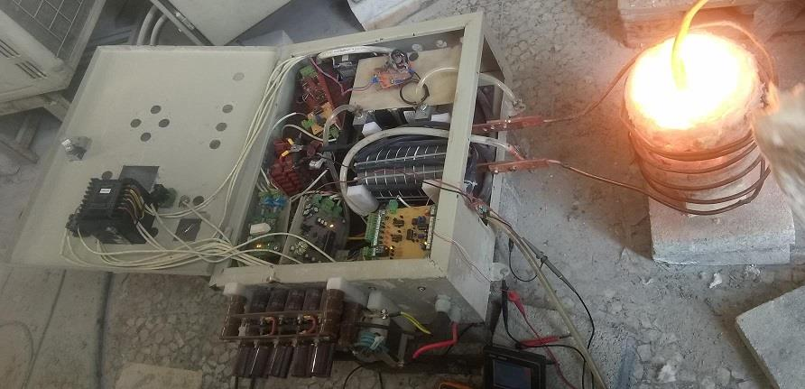
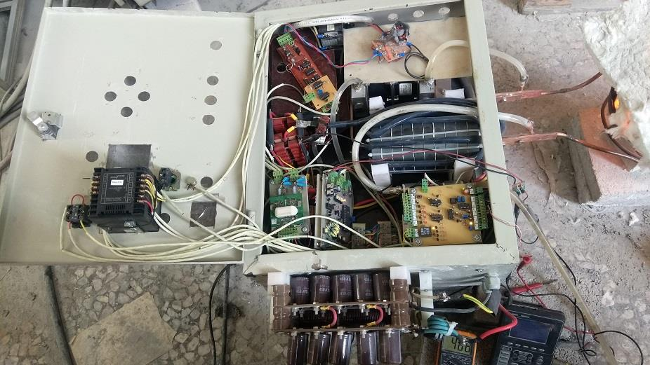
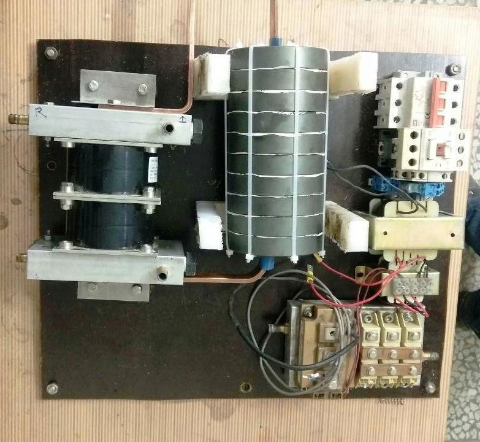

## Induction Heating, 30KW, Mode 2
Note: It's a prototype.  
Note: The display panel and the Controller board based on AVR MCU removed. 
Note: Used of a Digital 3-Phase Voltmeter Ampere Meter.  
Note: Three-phase dimmer board and IGBT driver board were used without modification.  

### Photo
Full View: v1.0  
 

### Features
- 3-Phase
- Half-Bridge with IGBT 

### Project Details
- Client from [Dirgodaz Amol Industries Inc., Iran](https://dirgodazamol.com/en/)
- Work type was on-site
- Date in Oct 2020 - Nov 2020
 
### My Tasks
- PCB design and home-made of new boards 
- PCB assembly of all boards
- Panel integration
- Electrical wiring
- System testing
- Commissioning support

### More photo:
Full View: v1.0  
 

Inverter Panel: v1.0  
  