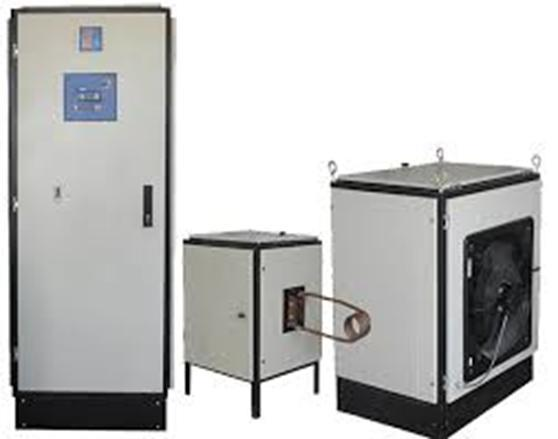

## Induction Heating, 50KW 
Note: It was a prototype.

### Photo
Full View: v1.0  
 

### Features
- 3-Phase
- Full-Bridge with IGBT

### Project Details
- Client from [Dirgodaz Amol Industries Inc., Iran](https://dirgodazamol.com/en/)
- Work type was on-site
- Date in Jan 2017 - Jul 2018

### My Tasks
- Hardware Design, PCB Design, and PCB assembly of these boards:
  - [Full Bridge IGBT Driver for Induction Heating, Based On SKYPER32R Module](https://github.com/AliRezaJoodi/AliRezaJoodi.github.io/blob/main/ProjectNotes/DirgodazAmol_IgbtDriver_FullBridge_BasedOnSKYPER32R.md)
  - [3-Phase Dimmer, Based on Analog](https://github.com/AliRezaJoodi/AliRezaJoodi.github.io/blob/main/ProjectNotes/DirgodazAmol_PhaseDimmer_3Phase_BasedOnAnalog.md)
  - [3-Phase Dimmer, Based on AVR MCU](https://github.com/AliRezaJoodi/AliRezaJoodi.github.io/blob/main/ProjectNotes/DirgodazAmol_PhaseDimmer_3Phase_BasedOnAVR.md)
  - [12V/5A Full-Bridge DC Motor Driver, Based on MOSFETs with Isolated Input](https://github.com/AliRezaJoodi/AliRezaJoodi.github.io/blob/main/ProjectNotes/DirgodazAmol_DcMotorDriver_FullBridge_Isolated_12V5A.md)
  - [Isolated Current and Voltage Measurement for Induction Heating (THD)](https://github.com/AliRezaJoodi/AliRezaJoodi.github.io/blob/main/ProjectNotes/DirgodazAmol_IsolatedCurrentAndVoltageMeasurement_THD.md)
  - [Isolated Current and Voltage Measurement for Induction Heating (SMD)](https://github.com/AliRezaJoodi/AliRezaJoodi.github.io/blob/main/ProjectNotes/DirgodazAmol_IsolatedCurrentAndVoltageMeasurement_SMD.md)
  - [Controller Board for Induction Heating Base on AVR MCU](https://github.com/AliRezaJoodi/AliRezaJoodi.github.io/blob/main/ProjectNotes/DirgodazAmol_ControllerBoardForInductionHeating.md)
  - [Multiple Power Supply for Induction Heating](https://github.com/AliRezaJoodi/AliRezaJoodi.github.io/blob/main/ProjectNotes/DirgodazAmol_PowerSupplyForInductionHeating.md)
  - Display Panel using 20×4 Character LCD
  - [Capacitor package](https://github.com/AliRezaJoodi/AliRezaJoodi.github.io/blob/main/ProjectNotes/DirgodazAmol_CapacitorPackageForInductionHeating50KW.md)
- Panel integration
- Electrical wiring
- System testing
- Commissioning support

### Video
v1.0  
[A link on Youtube.com](https://www.youtube.com/watch?v=VnA-OOWKcfw) 

### More photo
  
 