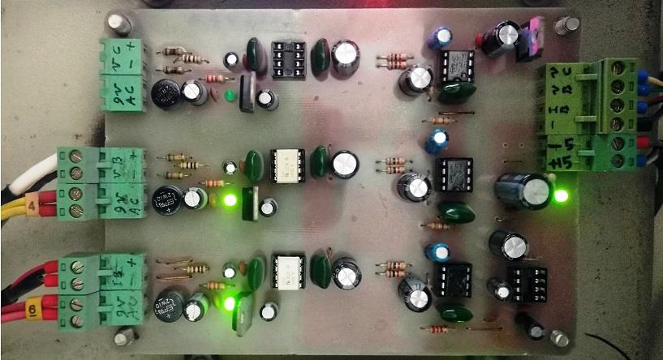
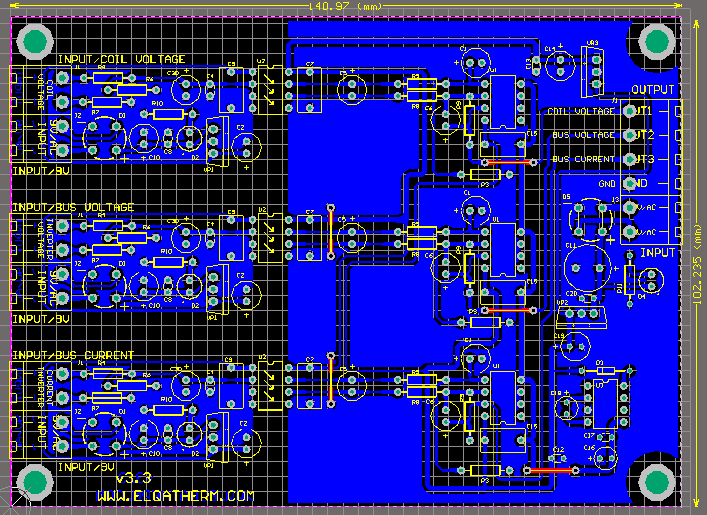

## Isolated Current and Voltage Measurement for Induction Heating (THD)

### Photos
v3.3  

v3.3, PCB, 2D  

### Features
- 3 isolated voltage channels using HCPL-7840
- Inverter bus voltage measurement
- Coil voltage measurement
- Inverter current measurement using shunt
- Using THD package components
- 1-Layer PCB

### Project Details
- Client from [Dirgodaz Amol Industries Inc., Iran](https://dirgodazamol.com/en/)
- Work type was on-site

### My Tasks 
- Hardware Design (30%)
- PCB Design (100%)
- PCB Assembly (100%)

