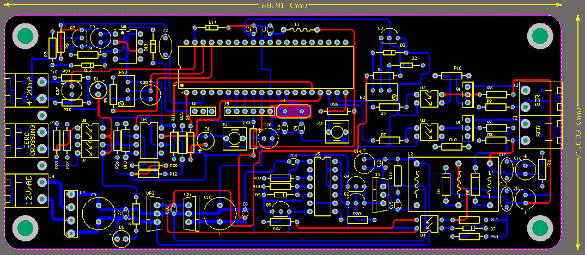
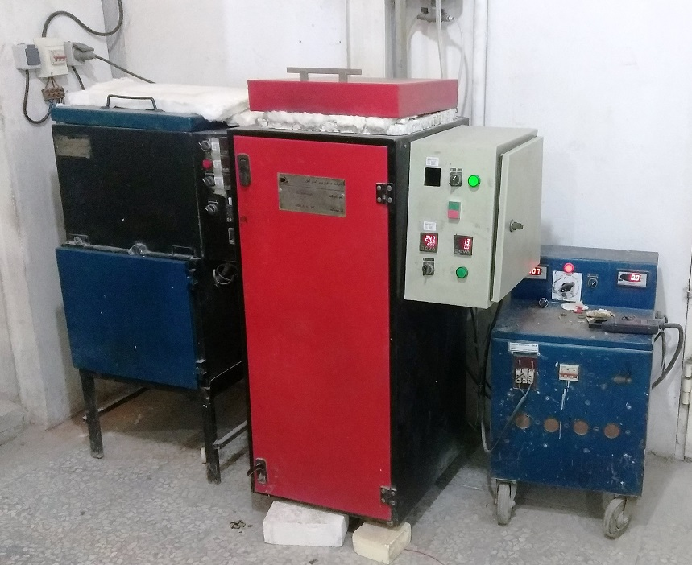
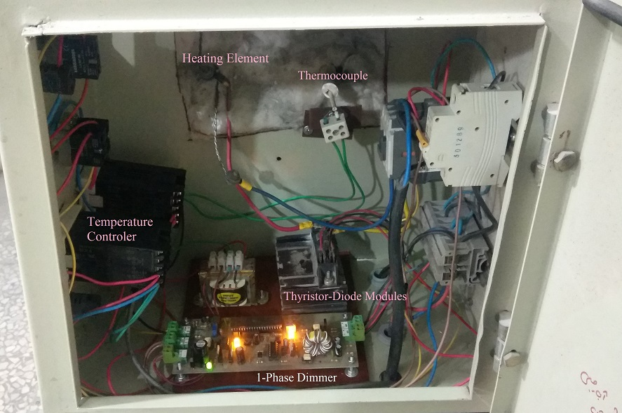
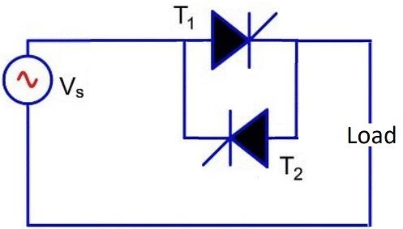

## Single-Phase Dimmer, Based on AVR MCU

### Photo
v2.1, PCB, 2D  

Electrical furnace    
  
  

### Features
- ATmega32 Microcontroller
- External Watchdog
- Voltage Reference with LM336
- 4-20mA or 1~5V Analog Input
- Zero Crossing Detector
- Dual Isolated Power Supply for SCR Drivers
- SCR Gate Driver (2x)
- Requires external Thyristor or Triac
- 2-Layer PCB

### Project Details
- Client from [Dirgodaz Amol Industries Inc., Iran](https://dirgodazamol.com/en/)
- Work type was on-site
- Date in Sep 2017 - Oct 2017

### My Tasks   
- Hardware Design (100%)
- PCB Design (100%)
- PCB Assembly (100%)
- AVR Programming (100%)

### Application
- 1-Phase Full Wave Rectifier with Half Controlled
- 1-Phase Dimmer

### Guide
Electrical Circuit, 1-Phase Full Wave Rectifier with Half Controlled  

Electrical Circuit, 1-Phase Dimmer with Thyristor double  

