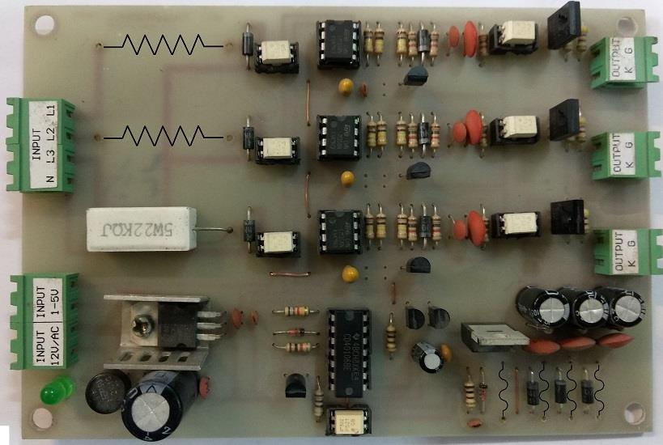
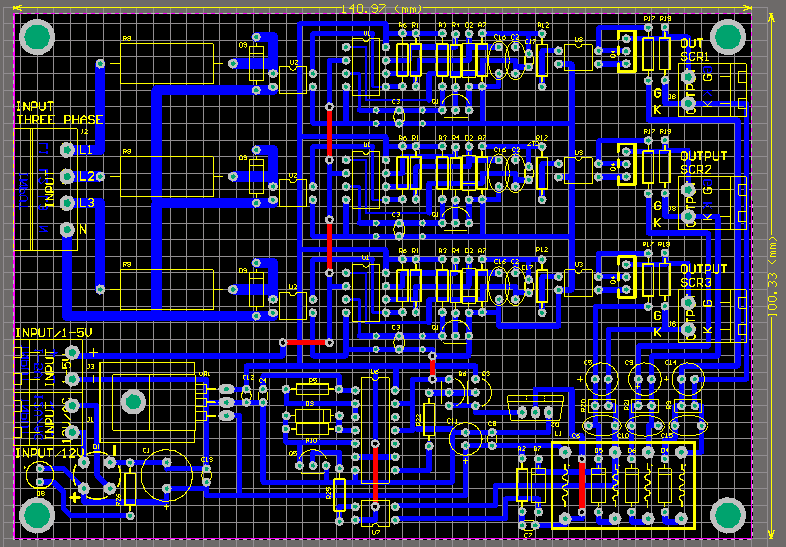
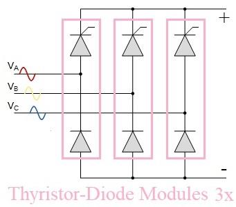

## 3-Phase Dimmer, Half-Controlled Full-Wave Rectifier, Based on Analog

### Photo
v1.1  

v1.1, PCB, 2D  

### Features
- 4-20mA or 1~5V Analog Input
- Zero Crossing Detector x3
- Triple Isolated Power Supply for SCR Drivers
- SCR Gate Driver (3x)
- Requires external Thyristor or Triac
- 1-Layer PCB

### Project Details
- Client from [Dirgodaz Amol Industries Inc., Iran](https://dirgodazamol.com/en/)
- Work type was on-site
- Date in Feb 2017 - Mar 2017

### My Tasks
- PCB Design (100%)
- PCB Assembly (100%)

### Application
- 3-Phase Full Wave Rectifier with Half Controlled

### Guide
Electrical Circuit, 3-Phase Full Wave Rectifier with Half Controlled  

