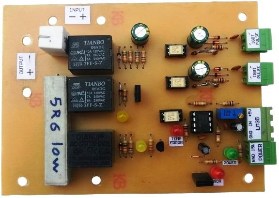
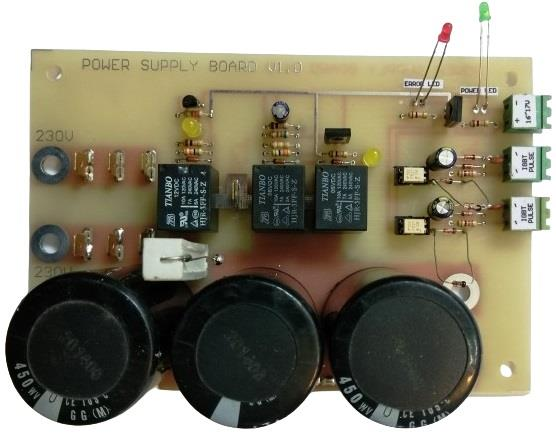
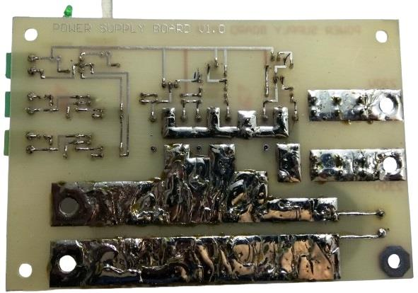

## Power Supply for ARC Welder

### Photo
Model 2: v1.0  

Model 1: v1.0  

Model 1: v1.0, Bottom  

### Features for Model 1:
- Soft Start
- IGBT Pulse Disconnect Protection
- Internal Capacitors
- External Diode Bridge

### Features for Model 2:
- Soft Start
- IGBT Pulse Disconnect Protection
- Thermal Protection
- External Capacitors
- External Diode Bridge

### Project Details
- Client from [Dirgodaz Amol Industries Inc., Iran](https://dirgodazamol.com/en/)
- Work type was on-site

### My Tasks
- Hardware Design (90%)
- PCB Design (100%)
- PCB Assembly (100%)