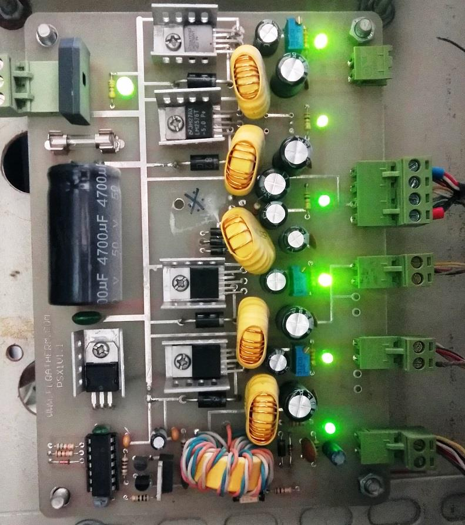

## Multiple Power Supply for Induction Heating

### Photo
v1.1  

### Features
- 1.2V to 37V Adjustable Output with LM2596 (x4)
- -5V Fixed Output with LM2596
- +12V Isolated Output with Flyback DC-DC Converter

### Project Details
- Client from [Dirgodaz Amol Industries Inc., Iran](https://dirgodazamol.com/en/)
- Work type was on-site

### My Tasks
- Hardware Design (100%)
- PCB Design (100%)
- PCB Assembly (100%)