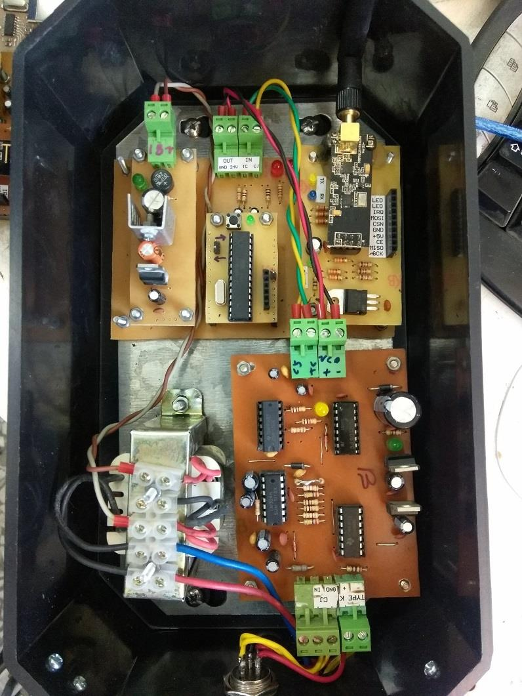
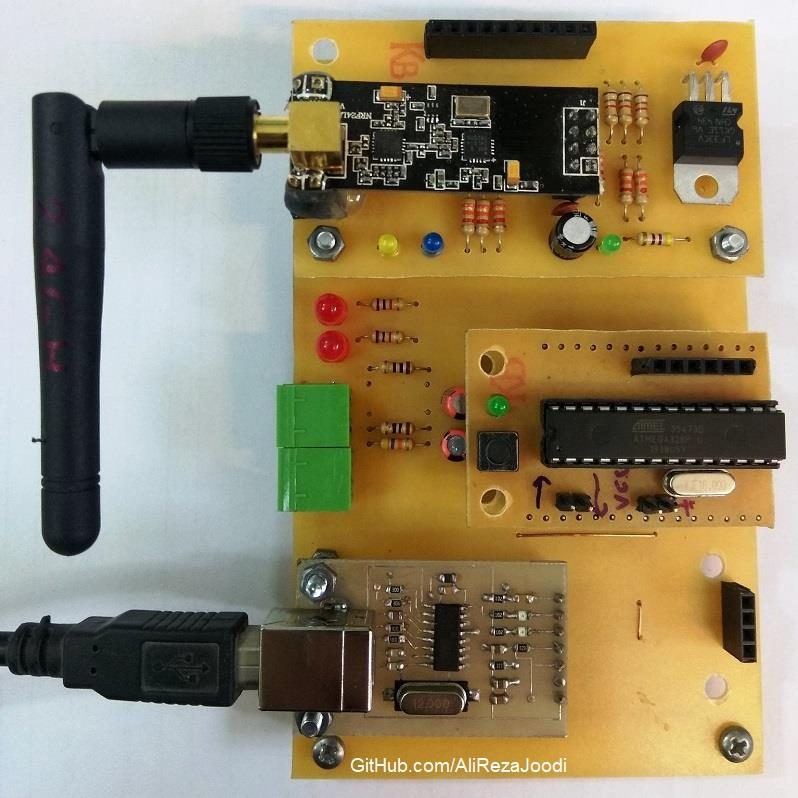
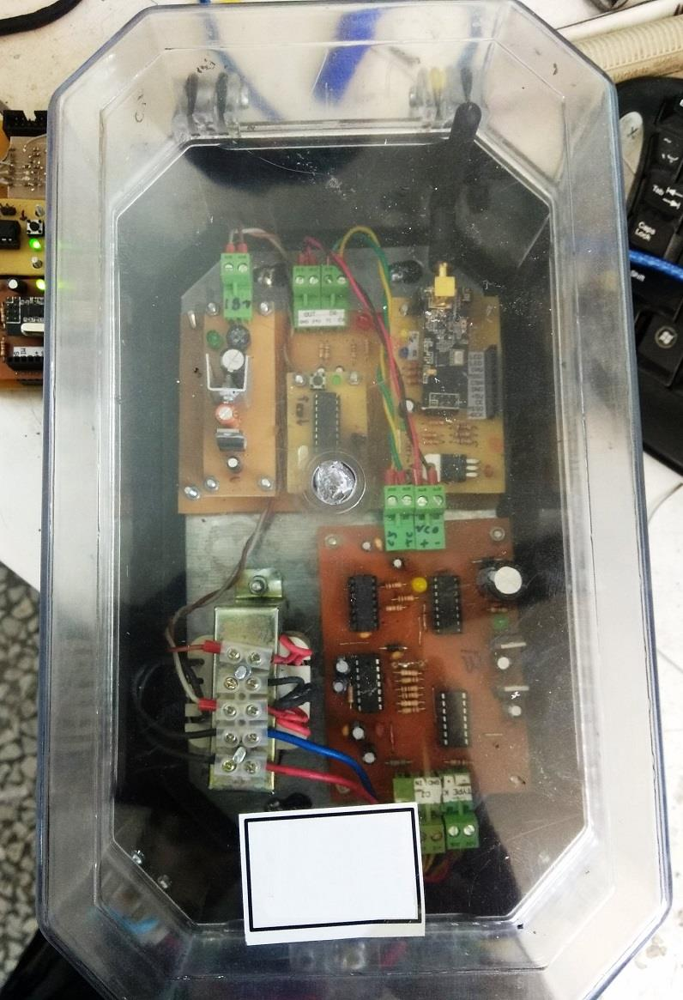
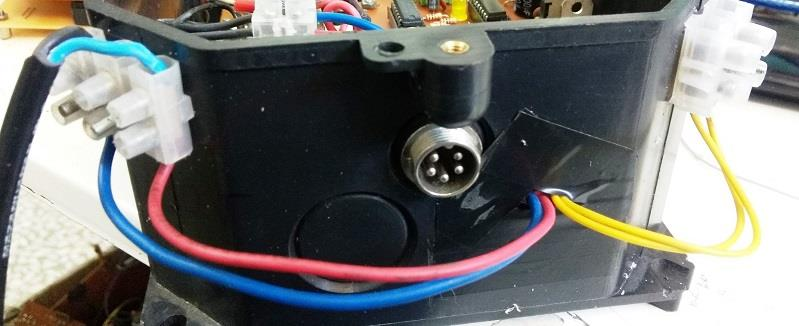
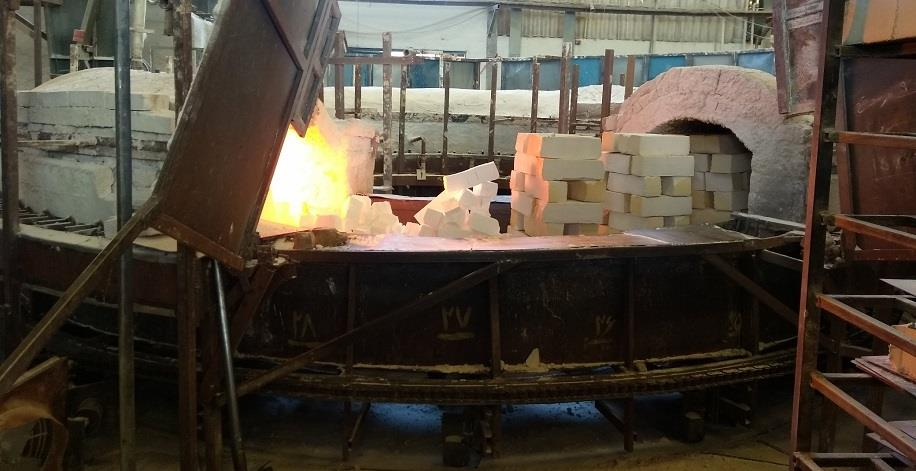

## Wireless Temperature Monitoring for 3 Gas Furnaces with Graphs in LabVIEW
   
The system consists of 3 transmitter boards and 1 receiver board.  
Each transmitter is installed on a separate gas furnace.  
The receiver is connected to the PC and sends the collected data to LabVIEW for display and analysis.  
The devices communicate wirelessly in a mesh network using NRF24L01 modules.  

### Photo
Transmitter    

Receiver: v1.1  

### Transmitter Features
- Includes 3 transmitters, expandable for more.
- Battery-powered transmitter for a rotating furnace; two other units are mains-powered.
- Wireless communication using NRF24L01 module.
- Thermocouple Amplifier with Auto-Zero Offset Cancellation.
- Compatible with various thermocouple types (S, B, and K).

### Receiver Features
- Wireless communication using NRF24L01 module.
- Connected to the PC via USB.
- Sends data to LabVIEW for graphical display.

### Project Details
- Client from [Dirgodaz Amol Industries Inc., Iran](https://dirgodazamol.com/en/)
- Work type was on-site.
- Date in Apr 2020 - May 2020

### My Tasks
- Hardware Design (100%)
- PCB Design (100%)
- AVR Programming (100%)
- System Testing
- Commissioning Support
- Operated the System

Note: LabVIEW graphical software developed by my colleague.

### More Photos
Transmitter    

Thermocouple   

Gas Furnace   

