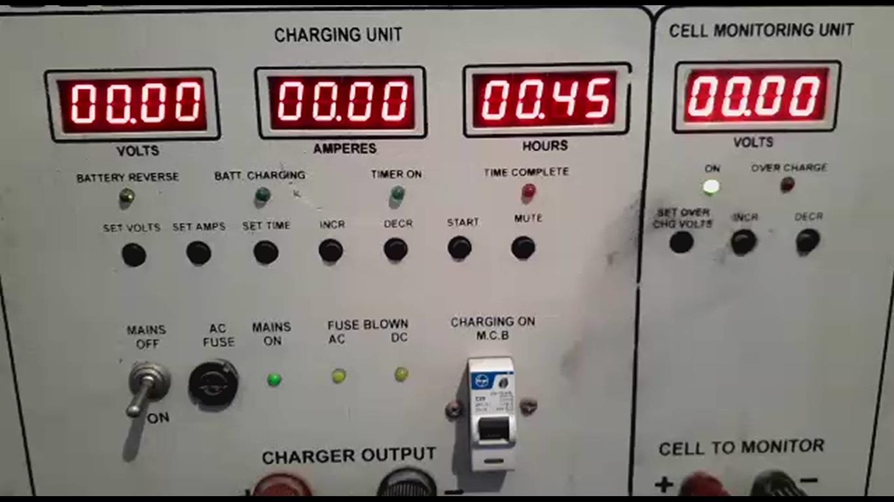
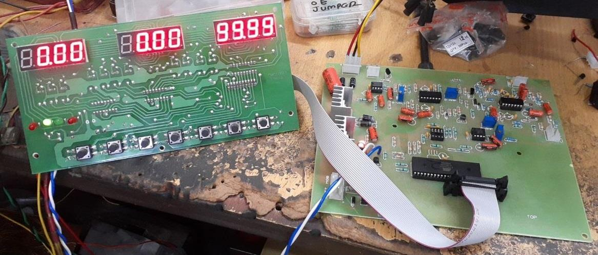
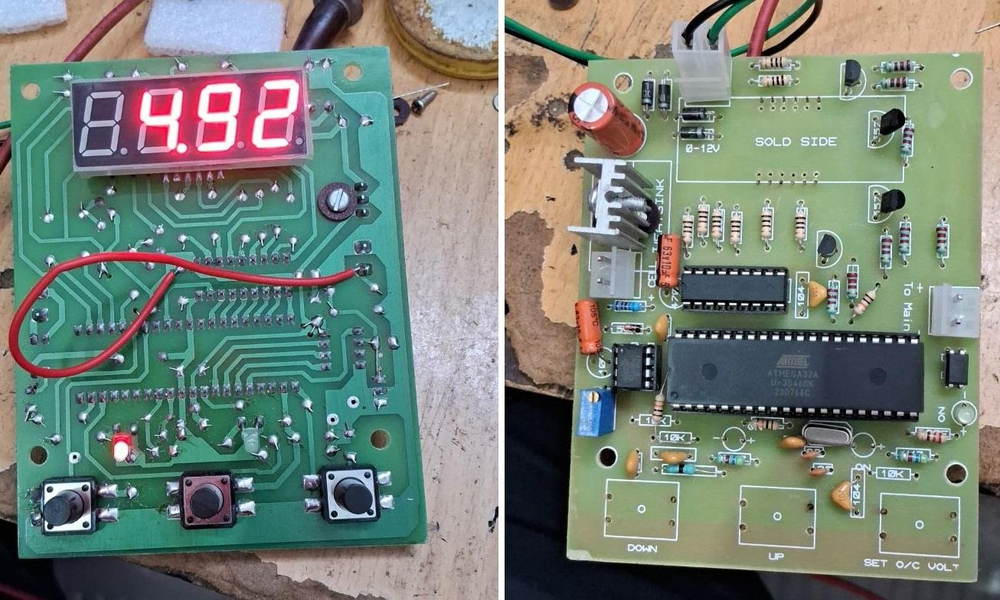
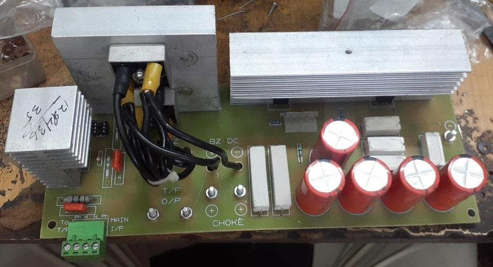

## Battery Charger with Transformer, 40V/30A
The analog circuit was reverse-engineered.  
The original project was based on the 8051 microcontroller, but we redesigned it with AVR.  

### Photo
Original Device Panel:  

### Project Details
- Client from India
- Work type was remote
- Date in Apr 2023 - Jun 2023

### My Tasks
- Reverse-engineering the schematic (50%)
- Consulting on PCB design
- AVR programming (100%)
- Consulting on manufacturing

### More Photos
Main Board and Display Board: v1.0  

Cell Volt Board: v1.0  

Power Board: v1.0  

